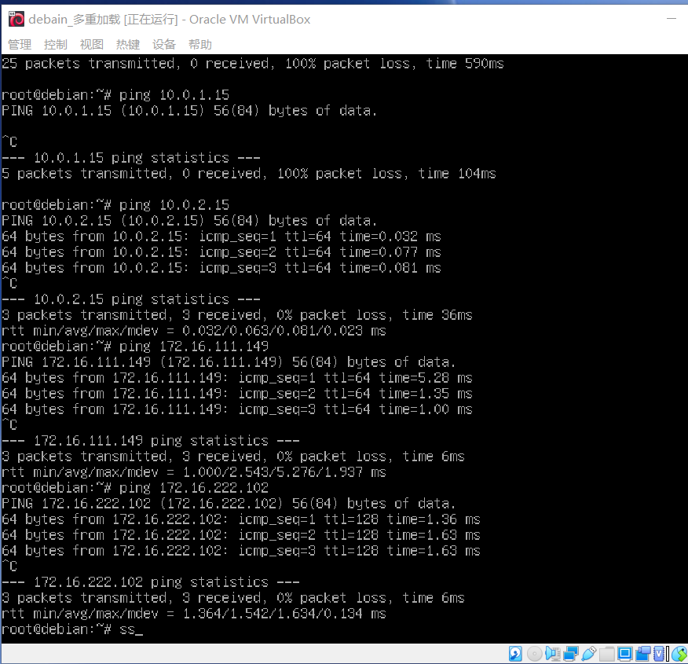

# 基于 VirtualBox 的网络攻防基础环境搭建

## 实验目的

- 掌握 VirtualBox 虚拟机的安装与使用；
- 掌握 VirtualBox 的虚拟网络类型和按需配置；
- 掌握 VirtualBox 的虚拟硬盘多重加载；

## 实验环境

-  VirtualBox 虚拟机
    - 攻击者主机（Attacker）：Kali
    - 网关（Gateway, GW）：Debian Buster
    - 靶机（Victim）：xp-sp3 / Kali

## 实验要求

- 虚拟硬盘配置成多重加载
    1. 在虚拟机-工具-虚拟介质管理中，将选定的.vdi文件类型修改为多重加载。
    2. 新建虚拟机，使用已有的虚拟硬盘文件,选择对应的多重加载类型的文件，创建虚拟机。
    

- 搭建虚拟机网络拓扑
  1. 配置网关(虚拟机名称：debain_多重加载)
        - 设置网卡，区分内部网络intnet1,intnet2
        
        - `ip a` 查询IP地址
        
  2. 设置靶机
        - 将网卡1设置为内部网络,界面名称选择intnet1/intnet2
        - xp-sp3类型虚拟机将控制芯片修改为PCnet-FAST III
        
        - `ip a` 查询IP地址
  3. 设置攻击者主机
        - 将网卡1设置为NAT网络,`ip a` 查询IP地址
        

  - 网关(虚拟机名称：debain_多重加载)
    | 网卡 | IP地址 |
    | - | - |
    | 网卡2 | 192.168.56.113 |
    | 网卡3(intnet1) | 172.16.111.1 |
    | 网卡4(intnet2) | 172.16.222.1 |
  - 靶机
    | 类型 | 虚拟机名称 | 内部网络 | IP地址 |
    | - | - | - | - |
    | kali |kali_多重加载| intnet1 | 172.16.111.149 |
    | xp-sp3 |xp_多重加载| intnet1 | 172.16.111.105 |
    | kali | kali_靶机2 | intnet2 | 172.16.222.109 |
    | xp-sp3 | xp_靶机2 | intnet2 | 172.16.222.102 |
  - 攻击者主机
    - 虚拟机名称：attacker_kali, ip地址：10.0.2.5

- 完成以下网络连通性测试；
    - [x] 靶机可以直接访问攻击者主机
        
        
        
        
    - [x] 攻击者主机无法直接访问靶机
        
    - [x] 网关可以直接访问攻击者主机和靶机
        
    - [x] 靶机的所有对外上下行流量必须经过网关
        ```
          apt update && apt install tmux
          apt install tcpdump
          tcpdump -i enp0s10 -n -w 20210910.1.pcap #对连接intnet2内部网络的靶机进行抓包
        ```
        
    - [x] 所有节点均可以访问互联网
        
        
        

## 实验中的问题

- root用户通过ssh远程登陆时报错Permission denied

    1. 修改配置文件`vi /etc/ssh/sshd_config`
    2. 将`PermitRootLogin prohibit-password`修改为`PermitRootLogin yes`
    
    3. 重启ssh服务`/etc/init.d/ssh restart`
    4. 重新连接
- 设置NAT网络提示无效设置

    1. 管理-全局设定-网络中添加nat网络配置
     

## 参考资料

- [NAT网络设置](https://mbd.baidu.com/ma/s/pC62V5yE)
- [root用户ssh远程登陆问题](https://blog.csdn.net/weixin_44623010/article/details/105556481)
- [老师的教学视频](https://b23.tv/ILGGuB)