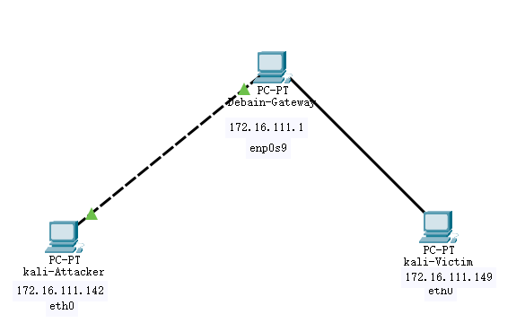

##  实验五：基于 Scapy 编写端口扫描器

### 实验目的

- 掌握网络扫描之端口状态探测的基本原理

### 实验环境

- python 2.7.18
- nmap 7.91
- Linux kali 5.10.0-kali7-amd64

### 实验要求(完成度)

- [x] TCP connect scan / TCP stealth scan
- [x] TCP Xmas scan / TCP fin scan / TCP null scan
- [x] UDP scan
- [x] 上述每种扫描技术的实现测试均需要测试端口状态为：`开放`、`关闭` 和 `过滤` 状态时的程序执行结果
- [x] 提供每一次扫描测试的抓包结果并分析与课本中的扫描方法原理是否相符？如果不同，试分析原因；
- [x] 在实验报告中详细说明实验网络环境拓扑、被测试 IP 的端口状态是如何模拟的
- [x] （可选）复刻 `nmap` 的上述扫描技术实现的命令行参数开关（每种扫描测试一种状态，且后面专门用nmap进行了扫描实验）

### 实验过程

#### 网络拓扑


Attacker作为扫描端，Victim作为被扫描的靶机。

#### 端口状态模拟

- **关闭状态**：对应端口没有开启监听, 防火墙没有开启。
  ```bash
  ufw disable
  ```
- **开启状态**：对应端口开启监听: apache2基于TCP, 在80端口提供服务; DNS服务基于UDP,在53端口提供服务。防火墙处于关闭状态。
  ```bash
  systemctl start apache2 # port 80
  systemctl start dnsmasq # port 53
  ```
- **过滤状态**：对应端口开启监听, 防火墙开启。
  ```bash
  ufw enable && ufw deny 80/tcp
  ufw enable && ufw deny 53/udp
  ```


初始状态：


（以下连续三幅图片分别为 ``运行代码测试的结果``，``靶机抓包的结果``，``使用nmap复刻的结果``）
#### TCP connect scan

[code](code/tcp_connect_scan.py)

- Closed
  
  
- Open

  
- Filtered
  
  

#### TCP stealth scan

[Code](code/tcp_stealth_scan.py)

- Closed
  
  

- Open

  
- Filtered
  
  
#### TCP Xmas scan

[Code](code/tcp_xmas_scan.py)

- Closed
  
  
- Open

  
- Filtered
  
  

#### TCP fin scan
[Code](code/tcp_fin_scan.py)

- Closed
  
  
- Open

  

- Filtered
  
  

#### TCP null scan
[Code](code/tcp_null_scan.py)
- Closed
  
  
- Open

  

- Filtered
  
  


#### UDP scan
[Code](code/udp_scan.py)

- Closed
  
  

- Open

  
- Filtered
  
  
#### 其他实验问题的回答

- 提供每一次扫描测试的抓包结果并分析与课本中的扫描方法原理是否相符？如果不同，试分析原因；

  抓包以截图形式提供在每次扫描结果中。

  完全相符。

### 参考
[师姐的作业](https://github.com/CUCCS/2020-ns-public-LyuLumos/blob/ch0x05/ch0x05/README.md)